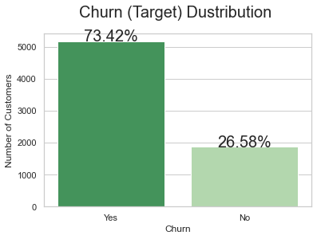
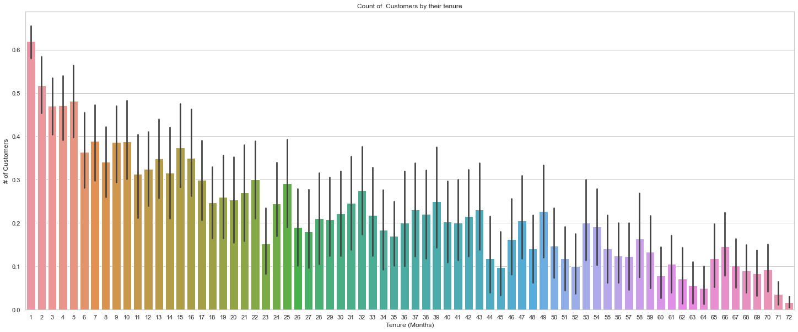
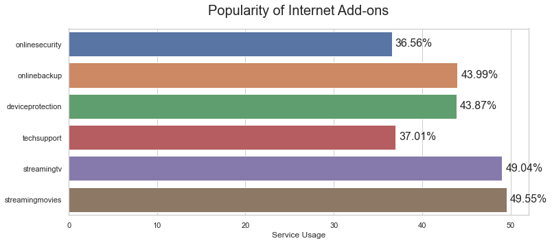
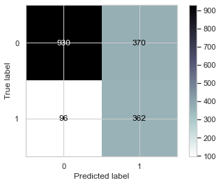
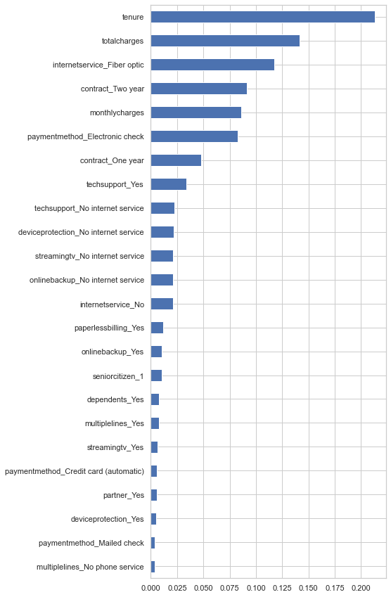

# Will they, won’t they

## Introduction
In this project we work with churn prediction and prevention.
Churn prediction is difficult. Before you can do anything to prevent customers leaving, you need to know everything from who’s going to leave and when, to how much it will impact on your company. 

## Main Business Goal

Main business goal is reducing customer churn before customer decide to churn
* Get to know telecom customers better, by accessing the data about their plans and usage, and getting in touch with interesting profiles
* Target clients with more effective advertising based on their usage profiles
* Retrieve customers with very high likeliness of churn so we could get in touch and offer them special deals before they even thought of leaving

## Dataset
My data set named - [Telco Customer Churn](https://www.kaggle.com/blastchar/telco-customer-churn) (Focused customer retention programs)

**Information from Kaggle about dataset:**
- Each row represents a customer, each column contains customer’s attributes described on the column Metadata.
- The raw data contains 7043 rows (customers) and 21 columns (features).
- The “Churn” column is our target.

## OSEMN

I worked with this dataset using OSEMN framework. All steps was saved into jupyter notebook files.

## The Project

The main goal of this project is to create a classification model.
I observed few models and best score which I had was 78% accuracy.
For each model project have:
* Classification Matrix
* Confusion Matrix

* Features Importance
* Some plots for ROC (Received operating characteristic)

## Questions

1. Which features decrease churn rate and which increase churn rate?
2. Is it predictive modeling helpful for telco companies? Can it handle the problem of customer churn?

3. What is companies needed to do to retain churning customers?

## Summary

Machine Learning is a powerfull tool to help us make the best decision.
